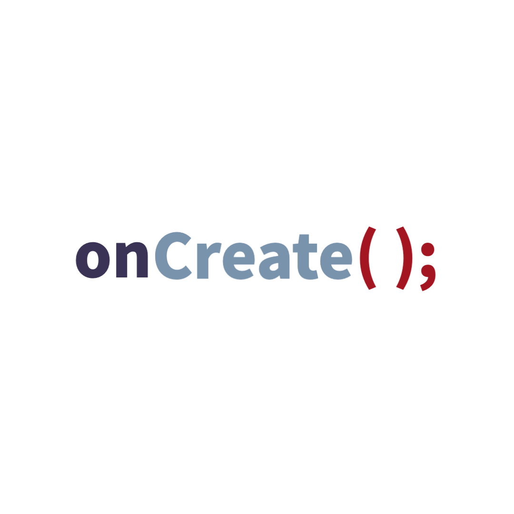

# onCreate

## Table of Contents
1. [Overview](#Overview)
1. [Product Spec](#Product-Spec)
1. [Wireframes](#Wireframes)
2. [Schema](#Schema)

## Overview
### Description

An app to help brainstorm ideas and to create a social media platform for users to share their ideas. The app allows users to organize/filter ideas, draw their ideas on a canvas, and distinguish their ideas between global and private feeds. 

### App Evaluation
- **Category:** Productivity / Organization
- **Mobile:** Native Android app that allows students to brainstorm their ideas, and rank and share them afterwards.
- **Story:** Many people have tons of good ideas, but forget to write them down or do not have a good place to store these ideas. Furthermore, a social media for ideas can provide inspiration for others and could be a way to encourage and foster brainstorming.
- **Market:** College students, workers, and anyone looking to brainstorm ideas for a company or app.
- **Habit:** Students can brainstorm 5 minutes every day practicing brainstorming activities.
- **Scope:** First, we intend **onCreate** to provide a place for brainstorming for individual users. Moreover, this could be expanded to provide a larger space for brainstorming that many users can use to share and rank ideas anonymously.

## Product Spec

### 1. User Stories (Required and Optional)

**Required Must-have Stories**

* Users can register for a new account
* User can login/logout
* User can create a profile w/ an profile picture and description
* Home page with all personal ideas of a user
    * User can star, and delete current ideas
* Brainstorming Page
    * User can can add a new idea
    * User can select photos from their gallery
* Profile page that shows profile image and description
* Navigation bar to transition between personal ideas, brainstorming, profile, etc..

**Optional Nice-to-have Stories**

* Filtering system for ideas
    * Different methods to filter by search
* Global idea page to share ideas anonymously
    * switching between top, hot, and recent ideas
    * Allows users to rank ideas (up/downvote ideas)
* Canvas drawing 
    * Users can draw sketches and upload them to their feed

### 2. Screen Archetypes

* Login Screen
    * User can login
* Registration Screen
    * User can create a new account and add their school email
* Create Profile Screen
    * User can create a new profile
* Private Screen
    * Home page
    * User can see their own private ideas
* Brainstorming Screen
    * User can create new ideas
    * User can select media (gallery images or canvas drawing)
* Canvas Drawing Screen
    * User can draw on their phone screen
    * User can select different stroke sizes and colors 
* Profile Screen
    * Displays users profile picture and description
* Global Screen
    * Small tab bar to switch ideas presented in feed: top, hot, recent
    * Users can upvote/downvote public ideas

### 3. Navigation

**Tab Navigation** (Tab to Screen)

*Once logged in*
* Private -> Profile -> Brainstorm -> Global/Private

**Flow Navigation** (Screen to Screen)
* Login Screen
    * -> home/idea
    * -> registration
* Registration Screen
    * -> create profile
* Create Profile Screen
    * -> home/idea
* Idea Screen
    * can navigate through tabs between:
        * Idea Screen
        * Brainstorming Screen
            * Canvas Drawing
            * Photo Gallery Select  
        * Profile Screen
        * Global Screen

## Wireframes
<!--  -->

<!-- ### [BONUS] Digital Wireframes & Mockups
### [BONUS] Interactive Prototype -->

## Schema

### Models
User

| Property | Type | Description |
| -------- | -------- | -------- |
| objectId | String | unique id for the user idea (default field) | 
| username      | String   | user's name |
| password      | String   | user's password for account |
| email         | String   | user's email for account |
| name          | String   | user's name |
| description   | String   | short description for the user |
| profileImage  | File     | image that the user has as their profile picture |
| ideaCount     | Number   | number of ideas a user has on their account |
| starIdeaCount | Number   | number of starred ideas a user has on their account |
| karma         | Number   | user's upvote score for posting on global section |
| createdAt     | DateTime | date when user account is created (default field) |
| updatedAt     | DateTime | date when user account is last updated (default field) |

Idea

| Property | Type | Description |
| -------- | -------- | -------- |
| objectId | String | unique id for the user idea (default field) | 
| author        | Pointer to User| image author |
| image         | File     | image that user has to accompany an idea |
| title         | String   | idea title by author |
| description   | String   | idea description body by author |
| isPrivate       | Boolean  | describing whether an idea is private or global |
| starred       | Boolean  | describing whether an idea is starred or not by the user |
| createdAt     | DateTime | date when idea is created (default field) |
| updatedAt     | DateTime | date when idea is last updated (default field) |
| upvotes       | Number   | the amount of upvotes a global idea has |
| downvotes     | Number   | the amount of downvotes a global idea has |
| upvoteUsers       | Array   | array of the users who have upvoted the post |
| downvoteUsers     | Array   | array of the users who have downvoted the post |

### Networking
- [Add list of network requests by screen ]
- [Create basic snippets for each Parse network request]
- [OPTIONAL: List endpoints if using existing API such as Yelp]

* Login Screen
    * (Read/GET) get a user with inputed password/username
* Registration Screen
    * (Create/POST) create a new user
* Create Profile Screen
    * (Update/PUT) update the previously created user's profile screen
* Private Idea Screen
    * (Read/GET) query for all ideas where the user is author
    * (Update/PUT) star an existing idea
    * (Update/PUT) update the information on an existing idea
    * (Delete) delete an existing idea
* Brainstorming Screen
    * (Create/POST) create a new post
* Profile Screen
    * (Read/GET) query for user's profile picture, description, and name for their profile screen
* Global Idea Screen
    * (Read/GET) query for all ideas in the database
    * (Update/PUT) up/downvote an existing
    * (Update/PUT) update the information on an existing user's idea
    * (Delete) delete an public idea

## Gifs

### Demo

